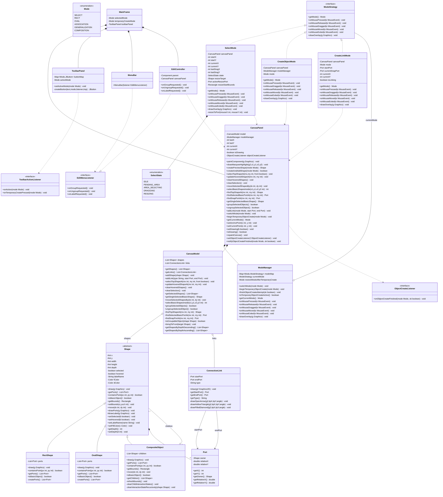

# OOP Final Project — Class Diagram (Mermaid)
> 111403005 曾芸儀

```mermaid
classDiagram
    %% ──────────── MODEL ────────────
    class Shape {
        <<abstract>>
        #int x
        #int y
        #int width
        #int height
        #int depth
        -boolean selected
        -boolean hovered
        -String labelName
        -Color fColor
        -Color dColor
        +draw(g Graphics)* void
        +getPorts()* List~Port~
        +containsPoint(px int, py int)* boolean
        +isBasicObject()* boolean
        +getBounds() Rectangle
        +setBounds(x,y,w,h int) void
        +move(dx int, dy int) void
        +drawPorts(g Graphics) void
        #drawLabel(g Graphics) void
        +setSelected(b boolean) void
        +setHovered(b boolean) void
        +setLabelName(name String) void
        +setFillColor(c Color) void
        +getDepth() int
        +setDepth(d int) void
    }

    class RectShape {
        -List~Port~ ports
        +draw(g Graphics) void
        +containsPoint(px int, py int) boolean
        +getPorts() List~Port~
        +isBasicObject() boolean
        -createPorts() List~Port~
    }

    class OvalShape {
        -List~Port~ ports
        +draw(g Graphics) void
        +containsPoint(px int, py int) boolean
        +getPorts() List~Port~
        +isBasicObject() boolean
        -createPorts() List~Port~
    }

    class CompositeObject {
        -List~Shape~ children
        +draw(g Graphics) void
        +getPorts() List~Port~
        +containsPoint(px int, py int) boolean
        +getBounds() Rectangle
        +move(dx int, dy int) void
        +isBasicObject() boolean
        +getChildren() List~Shape~
        -refreshBounds() void
        -clearChildInteractionStates() void
        -clearInteractionStateRecursively(shape Shape) void
    }

    class Port {
        -Shape owner
        -double relativeX
        -double relativeY
        +getX() int
        +getY() int
        +getOwner() Shape
        +getRelativeX() double
        +getRelativeY() double
    }

    class ConnectionLink {
        -Port startPort
        -Port endPort
        -String type
        +draw(g2 Graphics2D) void
        +getStartPort() Port
        +getEndPort() Port
        +getType() String
        -drawOpenArrow(g2,tipX,tipY,angle) void
        -drawHollowTriangle(g2,tipX,tipY,angle) void
        -drawFilledDiamond(g2,tipX,tipY,angle) void
    }

    class CanvasModel {
        -List~Shape~ shapes
        -List~ConnectionLink~ links
        +getShapes() List~Shape~
        +getLinks() List~ConnectionLink~
        +addShape(shape Shape) void
        +addLink(type String, start Port, end Port) void
        +selectTopShapeAt(mx int, my int, front boolean) void
        +updateHoveredShapeAt(mx int, my int) void
        +clearHoveredShapes() void
        +clearSelection() void
        +getSelectedShapes() List~Shape~
        +getSingleSelectedBasicShape() Shape
        +moveSelectedShapesBy(dx int, dy int) void
        +selectBasicShapesInside(x1,y1,x2,y2 int) int
        +groupSelectedObjects() boolean
        +ungroupSelectedObject() boolean
        +findTopShapeAt(mx int, my int) Shape
        +findSelectedBasicPortAt(mx int, my int) Port
        +findSnapPortAt(mx int, my int) Port
        +isGroupableObject(shape Shape) boolean
        +bringToFront(target Shape) void
        +getShapesByDepthDescending() List~Shape~
        +getShapesByDepthAscending() List~Shape~
    }

    %% ──────────── CONTROLLER ────────────
    class Mode {
        <<enumeration>>
        SELECT
        RECT
        OVAL
        ASSOCIATION
        GENERALIZATION
        COMPOSITION
    }

    class ModeStrategy {
        <<interface>>
        +getMode() Mode
        +onMousePressed(e MouseEvent) void
        +onMouseReleased(e MouseEvent) void
        +onMouseDragged(e MouseEvent) void
        +onMouseMoved(e MouseEvent) void
        +onMouseExited(e MouseEvent) void
        +drawOverlay(g Graphics) void
    }

    class SelectState {
        <<enumeration>>
        IDLE
        PENDING_AREA
        AREA_SELECTING
        DRAGGING
        RESIZING
    }

    class SelectMode {
        -CanvasPanel canvasPanel
        -int startX
        -int startY
        -int currentX
        -int currentY
        -int lastDragX
        -int lastDragY
        -SelectState state
        -Shape resizeTarget
        -Port activeResizePort
        -Rectangle resizeStartBounds
        +getMode() Mode
        +onMousePressed(e MouseEvent) void
        +onMouseDragged(e MouseEvent) void
        +onMouseReleased(e MouseEvent) void
        +onMouseMoved(e MouseEvent) void
        +onMouseExited(e MouseEvent) void
        +drawOverlay(g Graphics) void
        -resizeToPort(mouseX int, mouseY int) void
    }

    class CreateObjectMode {
        -CanvasPanel canvasPanel
        -ModeManager modeManager
        -Mode mode
        +getMode() Mode
        +onMousePressed(e MouseEvent) void
        +onMouseDragged(e MouseEvent) void
        +onMouseReleased(e MouseEvent) void
        +onMouseMoved(e MouseEvent) void
        +onMouseExited(e MouseEvent) void
        +drawOverlay(g Graphics) void
    }

    class CreateLinkMode {
        -CanvasPanel canvasPanel
        -Mode mode
        -Port startPort
        -Port currentSnapPort
        -int currentX
        -int currentY
        -boolean isLinking
        +getMode() Mode
        +onMousePressed(e MouseEvent) void
        +onMouseDragged(e MouseEvent) void
        +onMouseReleased(e MouseEvent) void
        +onMouseMoved(e MouseEvent) void
        +onMouseExited(e MouseEvent) void
        +drawOverlay(g Graphics) void
    }

    class ModeManager {
        -Map~Mode,ModeStrategy~ modeMap
        -ModeStrategy currentMode
        -Mode restoreModeAfterTemporaryCreate
        +switchMode(mode Mode) void
        +beginTemporaryObjectCreate(mode Mode) void
        +finishObjectCreateAttempt(ok boolean) void
        +isTemporaryObjectCreateActive() boolean
        +getCurrentMode() Mode
        +onMousePressed(e MouseEvent) void
        +onMouseReleased(e MouseEvent) void
        +onMouseDragged(e MouseEvent) void
        +onMouseMoved(e MouseEvent) void
        +onMouseExited(e MouseEvent) void
        +drawOverlay(g Graphics) void
    }

    class EditController {
        -Component parent
        -CanvasPanel canvasPanel
        +onGroupRequested() void
        +onUngroupRequested() void
        +onLabelRequested() void
    }

    %% ──────────── VIEW ────────────
    class ObjectCreateListener {
        <<interface>>
        +onObjectCreateFinished(mode Mode, ok boolean) void
    }

    class EditMenuListener {
        <<interface>>
        +onGroupRequested() void
        +onUngroupRequested() void
        +onLabelRequested() void
    }

    class ToolbarActionListener {
        <<interface>>
        +onAction(mode Mode) void
        +onTemporaryCreatePressed(mode Mode) void
    }

    class CanvasPanel {
        -CanvasModel model
        -ModeManager modeManager
        -int lastX
        -int lastY
        -int currentX
        -int currentY
        -boolean isDrawing
        -ObjectCreateListener objectCreateListener
        +paintComponent(g Graphics) void
        +drawMarqueeHighlight(g2,x1,y1,x2,y2) void
        +createPreviewShape(mode Mode) Shape
        +createAndAddShape(mode Mode) boolean
        +selectTopShapeAt(mx,my int, front boolean) void
        +updateHoveredShapeAt(mx int, my int) void
        +clearHoveredShapes() void
        +clearSelection() void
        +moveSelectedShapesBy(dx int, dy int) void
        +selectBasicShapesInside(x1,y1,x2,y2 int) int
        +findTopShapeAt(mx int, my int) Shape
        +findSelectedBasicPortAt(mx int, my int) Port
        +findSnapPortAt(mx int, my int) Port
        +getSingleSelectedBasicShape() Shape
        +groupSelectedObjects() boolean
        +ungroupSelectedObject() boolean
        +addLink(mode Mode, start Port, end Port) void
        +switchMode(mode Mode) void
        +beginTemporaryObjectCreate(mode Mode) void
        +getCurrentMode() Mode
        +setAnchorPoint(x int, y int) void
        +setCurrentPoint(x int, y int) void
        +setDrawing(b boolean) void
        +isDrawing() boolean
        +repaintCanvas() void
        +setObjectCreateListener(l ObjectCreateListener) void
        +notifyObjectCreateFinished(mode Mode, ok boolean) void
    }

    class MainFrame {
        -Mode selectedMode
        -Mode temporaryCreateMode
        -ToolbarPanel toolbarPanel
    }

    class ToolbarPanel {
        -Map~Mode,JButton~ buttonMap
        -Mode activeMode
        +setActiveMode(mode Mode) void
        -createButton(text,mode,listener,tmp) JButton
    }

    class MenuBar {
        +MenuBar(listener EditMenuListener)
    }

    %% ──────────── RELATIONS ────────────
    Shape <|-- RectShape
    Shape <|-- OvalShape
    Shape <|-- CompositeObject
    CompositeObject "1" o-- "2..*" Shape : children
    Shape "1" *-- "4..8" Port : owns
    ConnectionLink --> Port : startPort
    ConnectionLink --> Port : endPort
    CanvasModel o-- Shape : shapes
    CanvasModel o-- ConnectionLink : links

    ModeStrategy <|.. SelectMode
    ModeStrategy <|.. CreateObjectMode
    ModeStrategy <|.. CreateLinkMode
    SelectMode *-- SelectState
    ModeManager o-- ModeStrategy : currentMode
    SelectMode ..> CanvasPanel
    CreateObjectMode ..> CanvasPanel
    CreateLinkMode ..> CanvasPanel

    CanvasPanel *-- ModeManager
    CanvasPanel *-- CanvasModel
    CanvasPanel ..> ObjectCreateListener
    EditController ..|> EditMenuListener
    MenuBar ..> EditMenuListener
    ToolbarPanel ..> ToolbarActionListener

    MainFrame *-- CanvasPanel
    MainFrame *-- ToolbarPanel
    MainFrame *-- MenuBar
    MainFrame *-- EditController
    EditController ..> CanvasPanel
```
