# UML Editor (Workflow Design)

一個基於 Java Swing 實作的互動式 **UML 編輯器**（UML Editor）。本專案採用嚴謹的物件導向設計原則（Object-Oriented Programming & Design Patterns），展示了經典設計模式在圖形化使用者介面（GUI）開發中的應用。

---

## 核心功能特色

- **多種操作模式**：
  - **Select 模式**：點選/框選物件、移動物件位置、動態縮放尺寸。
  - **Shape 建立**：可繪製 **矩形 (Rectangle)** 與 **圓形 (Oval)**，支援拖曳決定大小，建立後自動還原回原模式。
  - **UML 關聯線建立**：支援 **關聯線 (Association)**、**一般化線 (Generalization)** 與 **組合線 (Composition)** 三種線條類型。
- **連接點 (Port) 吸附系統**：
  - 基本物件（矩形與圓形）各有複數個連接點，線條會精確吸附於連接點。
  - 移動或縮放物件時，連接點座標動態更新，線條會**自動跟隨**物件移動。
- **物件群組化 (Group / Ungroup)**：
  - 支援將兩個以上選中的物件進行群組化（Group），使其成為單一複合對象。
  - 支援解鎖群組（Ungroup）。支援無限巢狀的群組結構。
- **層級管理 (Depth Management)**：
  - 物件具有繪製深度，可將選中物件移至最上層（Bring to Front），避免被遮擋。
- **物件命名與顏色修改 (Label & Color)**：
  - 可對選中的基本物件修改顯示名稱（Label）與填充顏色。

---

## 設計模式與物件導向設計 (OOD)

本專案實作了多個經典設計模式，以確保程式碼符合 **SOLID 原則**：

### 1. MVC (Model-View-Controller) 架構
為了解決視窗程式常見的「神類別（God Class）」問題，專案將職責明確分離：
- **Model** ([CanvasModel](file:///Users/yy/Documents/NCU/1142/OOP/OOP_finalv2/model/CanvasModel.java))：純資料層，負責管理所有形狀與關聯線的狀態，包含選取、群組、深度排序、Port 查詢等業務邏輯。
- **View** ([CanvasPanel](file:///Users/yy/Documents/NCU/1142/OOP/OOP_finalv2/view/CanvasPanel.java), [MainFrame](file:///Users/yy/Documents/NCU/1142/OOP/OOP_finalv2/view/MainFrame.java), [ToolbarPanel](file:///Users/yy/Documents/NCU/1142/OOP/OOP_finalv2/view/ToolbarPanel.java))：負責版面配置、畫布渲染與使用者事件轉發，不包含核心資料狀態。
- **Controller** ([ModeManager](file:///Users/yy/Documents/NCU/1142/OOP/OOP_finalv2/controller/ModeManager.java), [EditController](file:///Users/yy/Documents/NCU/1142/OOP/OOP_finalv2/controller/EditController.java))：處理按鈕與選單行為，並協調 Mode 策略進行相應處理。

### 2. 策略模式 (Strategy Pattern)
畫布在不同按鈕被按下時有完全不同的滑鼠事件行為（選取、畫圖、拉線）。
- 定義了 [ModeStrategy](file:///Users/yy/Documents/NCU/1142/OOP/OOP_finalv2/controller/ModeStrategy.java) 介面。
- 具體策略類別如 [SelectMode](file:///Users/yy/Documents/NCU/1142/OOP/OOP_finalv2/controller/SelectMode.java)、[CreateObjectMode](file:///Users/yy/Documents/NCU/1142/OOP/OOP_finalv2/controller/CreateObjectMode.java) 和 [CreateLinkMode](file:///Users/yy/Documents/NCU/1142/OOP/OOP_finalv2/controller/CreateLinkMode.java) 分別封裝各自的滑鼠事件邏輯。
- 符合 **開放封閉原則 (OCP)**：當未來需要新增第七種模式（如畫虛線）時，僅需新增一個實作類別，無需修改畫布核心程式。

### 3. 組合模式 (Composite Pattern)
為了實現規格中的「群組內還可以有群組（巢狀群組）」功能：
- [Shape](file:///Users/yy/Documents/NCU/1142/OOP/OOP_finalv2/model/Shape.java) 作為抽象基底類別（Component）。
- [RectShape](file:///Users/yy/Documents/NCU/1142/OOP/OOP_finalv2/model/RectShape.java) 與 [OvalShape](file:///Users/yy/Documents/NCU/1142/OOP/OOP_finalv2/model/OvalShape.java) 為葉子節點（Leaf）。
- [CompositeObject](file:///Users/yy/Documents/NCU/1142/OOP/OOP_finalv2/model/CompositeObject.java) 為容器節點（Composite），內部持有一個 `List<Shape>`。
- 用戶端代碼可以像處理單一基本物件一樣來處理群組物件（例如移動、選取、調整層級）。

### 4. 狀態模式 / 有限狀態機 (FSM)
在 [SelectMode](file:///Users/yy/Documents/NCU/1142/OOP/OOP_finalv2/controller/SelectMode.java) 中，為了處理諸如點選、框選中、拖曳中、縮放中等複雜滑鼠狀態切換，使用 `SelectState` enum (`IDLE`, `PENDING_AREA`, `AREA_SELECTING`, `DRAGGING`, `RESIZING`) 代替傳統的互斥 boolean 變數，大幅降低狀態混亂所引發的 Bug，且增強可讀性。

---

## 關鍵技術細節

### 1. 連接埠座標動態計算
[Port](file:///Users/yy/Documents/NCU/1142/OOP/OOP_finalv2/model/Port.java) 物件不儲存絕對座標，而是儲存相對於父物件的比例係數 `relativeX` 與 `relativeY`（例如矩形右方的 Port 為 `(1.0, 0.5)`）。
```
絕對 X 座標 = 父物件.getX() + 基準寬度 * relativeX
絕對 Y 座標 = 父物件.getY() + 基準高度 * relativeY
```
這使得物件在移動或縮放尺寸時，所有的 Ports 座標與相連的關聯線條會**自動更新位置**，免除手動重設線條端點的複雜通知機制。

### 2. 固定點縮放 (Fixed-Point Resize)
在縮放物件時，依據被拖曳的 Port，其對角線的 Port 必須保持固定不動（例如拖曳右下角 Port 縮放時，左上角必須維持固定）。此部分邏輯在 [SelectMode.java:L168](file:///Users/yy/Documents/NCU/1142/OOP/OOP_finalv2/controller/SelectMode.java#L168) 中的 `resizeToPort` 實作，確保符合直覺的拖曳縮放體驗。

---

## 類別圖 (Class Diagram)

以下是本專案的完整系統類別結構（以 Mermaid 表示）：

```mermaid
classDiagram
    %% ──────────── MODEL ────────────
    class Shape {
        <<abstract>>
        #int x
        #int y
        #int width
        #int height
        #int depth
        -boolean selected
        -boolean hovered
        -String labelName
        -Color fColor
        -Color dColor
        +draw(g Graphics)* void
        +getPorts()* List~Port~
        +containsPoint(px int, py int)* boolean
        +isBasicObject()* boolean
        +getBounds() Rectangle
        +setBounds(x,y,w,h int) void
        +move(dx int, dy int) void
        +drawPorts(g Graphics) void
        #drawLabel(g Graphics) void
        +setSelected(b boolean) void
        +setHovered(b boolean) void
        +setLabelName(name String) void
        +setFillColor(c Color) void
        +getDepth() int
        +setDepth(d int) void
    }

    class RectShape {
        -List~Port~ ports
        +draw(g Graphics) void
        +containsPoint(px int, py int) boolean
        +getPorts() List~Port~
        +isBasicObject() boolean
        -createPorts() List~Port~
    }

    class OvalShape {
        -List~Port~ ports
        +draw(g Graphics) void
        +containsPoint(px int, py int) boolean
        +getPorts() List~Port~
        +isBasicObject() boolean
        -createPorts() List~Port~
    }

    class CompositeObject {
        -List~Shape~ children
        +draw(g Graphics) void
        +getPorts() List~Port~
        +containsPoint(px int, py int) boolean
        +getBounds() Rectangle
        +move(dx int, dy int) void
        +isBasicObject() boolean
        +getChildren() List~Shape~
        -refreshBounds() void
        -clearChildInteractionStates() void
        -clearInteractionStateRecursively(shape Shape) void
    }

    class Port {
        -Shape owner
        -double relativeX
        -double relativeY
        +getX() int
        +getY() int
        +getOwner() Shape
        +getRelativeX() double
        +getRelativeY() double
    }

    class ConnectionLink {
        -Port startPort
        -Port endPort
        -String type
        +draw(g2 Graphics2D) void
        +getStartPort() Port
        +getEndPort() Port
        +getType() String
        -drawOpenArrow(g2,tipX,tipY,angle) void
        -drawHollowTriangle(g2,tipX,tipY,angle) void
        -drawFilledDiamond(g2,tipX,tipY,angle) void
    }

    class CanvasModel {
        -List~Shape~ shapes
        -List~ConnectionLink~ links
        +getShapes() List~Shape~
        +getLinks() List~ConnectionLink~
        +addShape(shape Shape) void
        +addLink(type String, start Port, end Port) void
        +selectTopShapeAt(mx int, my int, front boolean) void
        +updateHoveredShapeAt(mx int, my int) void
        +clearHoveredShapes() void
        +clearSelection() void
        +getSelectedShapes() List~Shape~
        +getSingleSelectedBasicShape() Shape
        +moveSelectedShapesBy(dx int, dy int) void
        +selectBasicShapesInside(x1,y1,x2,y2 int) int
        +groupSelectedObjects() boolean
        +ungroupSelectedObject() boolean
        +findTopShapeAt(mx int, my int) Shape
        +findSelectedBasicPortAt(mx int, my int) Port
        +findSnapPortAt(mx int, my int) Port
        +isGroupableObject(shape Shape) boolean
        +bringToFront(target Shape) void
        +getShapesByDepthDescending() List~Shape~
        +getShapesByDepthAscending() List~Shape~
    }

    %% ──────────── CONTROLLER ────────────
    class Mode {
        <<enumeration>>
        SELECT
        RECT
        OVAL
        ASSOCIATION
        GENERALIZATION
        COMPOSITION
    }

    class ModeStrategy {
        <<interface>>
        +getMode() Mode
        +onMousePressed(e MouseEvent) void
        +onMouseReleased(e MouseEvent) void
        +onMouseDragged(e MouseEvent) void
        +onMouseMoved(e MouseEvent) void
        +onMouseExited(e MouseEvent) void
        +drawOverlay(g Graphics) void
    }

    class SelectState {
        <<enumeration>>
        IDLE
        PENDING_AREA
        AREA_SELECTING
        DRAGGING
        RESIZING
    }

    class SelectMode {
        -CanvasPanel canvasPanel
        -int startX
        -int startY
        -int currentX
        -int currentY
        -int lastDragX
        -int lastDragY
        -SelectState state
        -Shape resizeTarget
        -Port activeResizePort
        -Rectangle resizeStartBounds
        +getMode() Mode
        +onMousePressed(e MouseEvent) void
        +onMouseDragged(e MouseEvent) void
        +onMouseReleased(e MouseEvent) void
        +onMouseMoved(e MouseEvent) void
        +onMouseExited(e MouseEvent) void
        +drawOverlay(g Graphics) void
        -resizeToPort(mouseX int, mouseY int) void
    }

    class CreateObjectMode {
        -CanvasPanel canvasPanel
        -ModeManager modeManager
        -Mode mode
        +getMode() Mode
        +onMousePressed(e MouseEvent) void
        +onMouseDragged(e MouseEvent) void
        +onMouseReleased(e MouseEvent) void
        +onMouseMoved(e MouseEvent) void
        +onMouseExited(e MouseEvent) void
        +drawOverlay(g Graphics) void
    }

    class CreateLinkMode {
        -CanvasPanel canvasPanel
        -Mode mode
        -Port startPort
        -Port currentSnapPort
        -int currentX
        -int currentY
        -boolean isLinking
        +getMode() Mode
        +onMousePressed(e MouseEvent) void
        +onMouseDragged(e MouseEvent) void
        +onMouseReleased(e MouseEvent) void
        +onMouseMoved(e MouseEvent) void
        +onMouseExited(e MouseEvent) void
        +drawOverlay(g Graphics) void
    }

    class ModeManager {
        -Map~Mode,ModeStrategy~ modeMap
        -ModeStrategy currentMode
        -Mode restoreModeAfterTemporaryCreate
        +switchMode(mode Mode) void
        +beginTemporaryObjectCreate(mode Mode) void
        +finishObjectCreateAttempt(ok boolean) void
        +isTemporaryObjectCreateActive() boolean
        +getCurrentMode() Mode
        +onMousePressed(e MouseEvent) void
        +onMouseReleased(e MouseEvent) void
        +onMouseDragged(e MouseEvent) void
        +onMouseMoved(e MouseEvent) void
        +onMouseExited(e MouseEvent) void
        +drawOverlay(g Graphics) void
    }

    class EditController {
        -Component parent
        -CanvasPanel canvasPanel
        +onGroupRequested() void
        +onUngroupRequested() void
        +onLabelRequested() void
    }

    %% ──────────── VIEW ────────────
    class ObjectCreateListener {
        <<interface>>
        +onObjectCreateFinished(mode Mode, ok boolean) void
    }

    class EditMenuListener {
        <<interface>>
        +onGroupRequested() void
        +onUngroupRequested() void
        +onLabelRequested() void
    }

    class ToolbarActionListener {
        <<interface>>
        +onAction(mode Mode) void
        +onTemporaryCreatePressed(mode Mode) void
    }

    class CanvasPanel {
        -CanvasModel model
        -ModeManager modeManager
        -int lastX
        -int lastY
        -int currentX
        -int currentY
        -boolean isDrawing
        -ObjectCreateListener objectCreateListener
        +paintComponent(g Graphics) void
        +drawMarqueeHighlight(g2,x1,y1,x2,y2) void
        +createPreviewShape(mode Mode) Shape
        +createAndAddShape(mode Mode) boolean
        +selectTopShapeAt(mx,my int, front boolean) void
        +updateHoveredShapeAt(mx int, my int) void
        +clearHoveredShapes() void
        +clearSelection() void
        +moveSelectedShapesBy(dx int, dy int) void
        +selectBasicShapesInside(x1,y1,x2,y2 int) int
        +findTopShapeAt(mx int, my int) Shape
        +findSelectedBasicPortAt(mx int, my int) Port
        +findSnapPortAt(mx int, my int) Port
        +getSingleSelectedBasicShape() Shape
        +groupSelectedObjects() boolean
        +ungroupSelectedObject() boolean
        +addLink(mode Mode, start Port, end Port) void
        +switchMode(mode Mode) void
        +beginTemporaryObjectCreate(mode Mode) void
        +getCurrentMode() Mode
        +setAnchorPoint(x int, y int) void
        +setCurrentPoint(x int, y int) void
        +setDrawing(b boolean) void
        +isDrawing() boolean
        +repaintCanvas() void
        +setObjectCreateListener(l ObjectCreateListener) void
        +notifyObjectCreateFinished(mode Mode, ok boolean) void
    }

    class MainFrame {
        -Mode selectedMode
        -Mode temporaryCreateMode
        -ToolbarPanel toolbarPanel
    }

    class ToolbarPanel {
        -Map~Mode,JButton~ buttonMap
        -Mode activeMode
        +setActiveMode(mode Mode) void
        -createButton(text,mode,listener,tmp) JButton
    }

    class MenuBar {
        +MenuBar(listener EditMenuListener)
    }

    %% ──────────── RELATIONS ────────────
    Shape <|-- RectShape
    Shape <|-- OvalShape
    Shape <|-- CompositeObject
    CompositeObject "1" o-- "2..*" Shape : children
    Shape "1" *-- "4..8" Port : owns
    ConnectionLink --> Port : startPort
    ConnectionLink --> Port : endPort
    CanvasModel o-- Shape : shapes
    CanvasModel o-- ConnectionLink : links

    ModeStrategy <|.. SelectMode
    ModeStrategy <|.. CreateObjectMode
    ModeStrategy <|.. CreateLinkMode
    SelectMode *-- SelectState
    ModeManager o-- ModeStrategy : currentMode
    SelectMode ..> CanvasPanel
    CreateObjectMode ..> CanvasPanel
    CreateLinkMode ..> CanvasPanel

    CanvasPanel *-- ModeManager
    CanvasPanel *-- CanvasModel
    CanvasPanel ..> ObjectCreateListener
    EditController ..|> EditMenuListener
    MenuBar ..> EditMenuListener
    ToolbarPanel ..> ToolbarActionListener

    MainFrame *-- CanvasPanel
    MainFrame *-- ToolbarPanel
    MainFrame *-- MenuBar
    MainFrame *-- EditController
    EditController ..> CanvasPanel
```



---

## 如何編譯與執行

### 開發環境需求
- Java SE Development Kit (JDK) 8 以上（推薦 JDK 11 或更高版本）

### 編譯專案
在專案根目錄下，開啟終端機並執行以下指令進行編譯：
```bash
javac -encoding UTF-8 -d bin Main.java controller/*.java model/*.java view/*.java
```

### 執行專案
編譯完成後，使用以下指令執行應用程式：
```bash
java -cp bin Main
```
